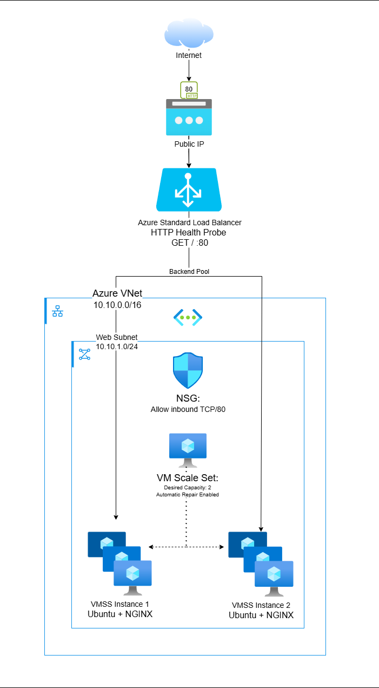

# Azure Auto-Healing Web Tier

## Overview

This project demonstrates a highly available, self-healing web tier in Microsoft Azure using Terraform.

The solution deploys two Ubuntu Linux instances running NGINX inside an Azure Virtual Machine Scale Set (VMSS), with traffic distributed through an Azure Standard Load Balancer.

The design meets the core assessment requirements by providing:

- **Self-healing** – unhealthy VM instances are automatically replaced
- **N+1 capacity** – two web instances sit behind a load balancer
- **Infrastructure as Code** – all Azure resources are defined in Terraform
- **Automated provisioning** – cloud-init installs and starts NGINX on each instance
- **Repeatability** – Terraform can recreate the same environment consistently

## Why Azure?

I selected Azure because my current professional experience is primarily within the Microsoft ecosystem, and this project gave me an opportunity to extend that experience into cloud infrastructure and Infrastructure as Code.

Azure Virtual Machine Scale Sets and Azure Load Balancer provide a straightforward way to demonstrate high availability, health monitoring and automatic instance replacement.

Terraform was used to keep the infrastructure declarative, repeatable and version controlled.

## Architecture



Traffic enters through a public IP and is distributed by an Azure Standard Load Balancer across two NGINX instances in the VM Scale Set.

An HTTP health probe monitors the instances. If one becomes unhealthy, traffic is directed to the remaining healthy instance while the VM Scale Set automatically replaces the failed instance.

## Deployment

### Prerequisites

- Terraform
- Azure CLI
- An Azure subscription
- An SSH key pair

Authenticate to Azure:

```powershell
az login
$env:ARM_SUBSCRIPTION_ID = az account show --query id -o tsv
```

Initialise Terraform:

```powershell
terraform init
```

Check formatting and validate the configuration:

```powershell
terraform fmt -check -recursive
terraform validate
```

Generate a Terraform execution plan:

```powershell
terraform plan -out="deployment.tfplan"
```

Optionally, view the plan in a human-readable format:

```powershell
terraform show -no-color deployment.tfplan
```

Provisioning the infrastructure is optional for this assessment. If deployment is required:

```powershell
terraform apply deployment.tfplan
```

A successful plan output is included in `terraform-plan.txt`.

## Self-Healing

The web tier runs two NGINX instances within an Azure Virtual Machine Scale Set.

An Azure Load Balancer performs an HTTP health probe against each instance. If an instance becomes unhealthy, the load balancer removes it from active traffic while the remaining instance continues serving requests.

Automatic instance repair is enabled on the VM Scale Set. The unhealthy instance is replaced and `cloud-init` automatically installs and starts NGINX on the replacement VM.

Once the replacement passes the health probe, it returns to the load balancer backend pool.

The VM Scale Set is configured with two instances to maintain N+1 capacity.

An Azure Monitor autoscale policy maintains a minimum capacity of two instances, restoring capacity if a VMSS instance is explicitly deleted.

## Assumptions

- The workload is a stateless static NGINX web page.
- Two VM instances are sufficient to demonstrate N+1 capacity.
- The availability requirement covers failure of a single VM rather than an entire Azure region.
- HTTP on TCP/80 is sufficient for this technical demonstration.
- Traffic and bandwidth usage are assumed to be minimal.
- Terraform state is stored locally for simplicity.
- VM configuration is automated using cloud-init rather than manual configuration.
- The environment is intended to be temporary and destroyed when not being tested or demonstrated.

## Estimated Monthly Cost

The environment is intended as an ephemeral technical assessment environment rather than a continuously running production workload.

The estimate assumes approximately **160 hours of deployment per month** (8 hours per working day for 20 days), with the complete environment destroyed when not in use using `terraform destroy`.

| Resource                            | Quantity | Estimated Monthly Cost |
| ----------------------------------- | -------: | ---------------------: |
| B1s Linux VM compute                |        2 |               AUD 5.87 |
| S4 managed OS disks                 |        2 |               AUD 1.50 |
| Azure Standard Load Balancer        |        1 |               AUD 5.56 |
| Standard static Public IPv4 address |        1 |               AUD 1.11 |
| Data transfer / processing          |  Minimal |              ~AUD 0.00 |
| **Estimated Total**                 |          |   **~AUD 14.04/month** |

Pricing is based on Azure Australia East pay-as-you-go rates and approximately 160 deployed hours per month.

The estimate assumes the complete Terraform environment is destroyed outside the stated runtime rather than left provisioned continuously.

For comparison, leaving the same environment deployed continuously for approximately 730 hours per month would exceed the assessment's AUD 20 target.
